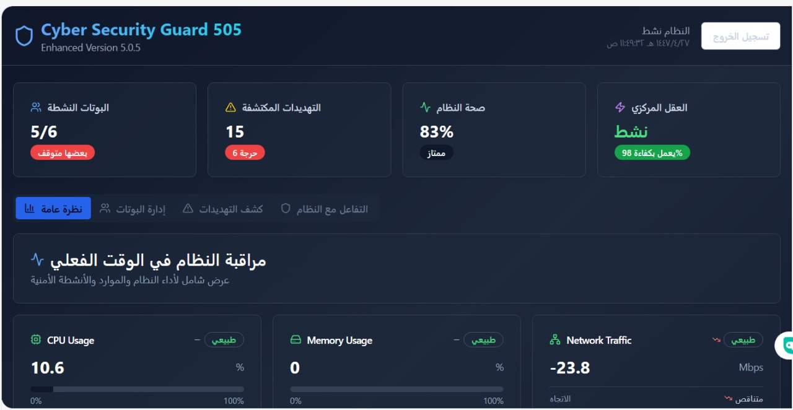
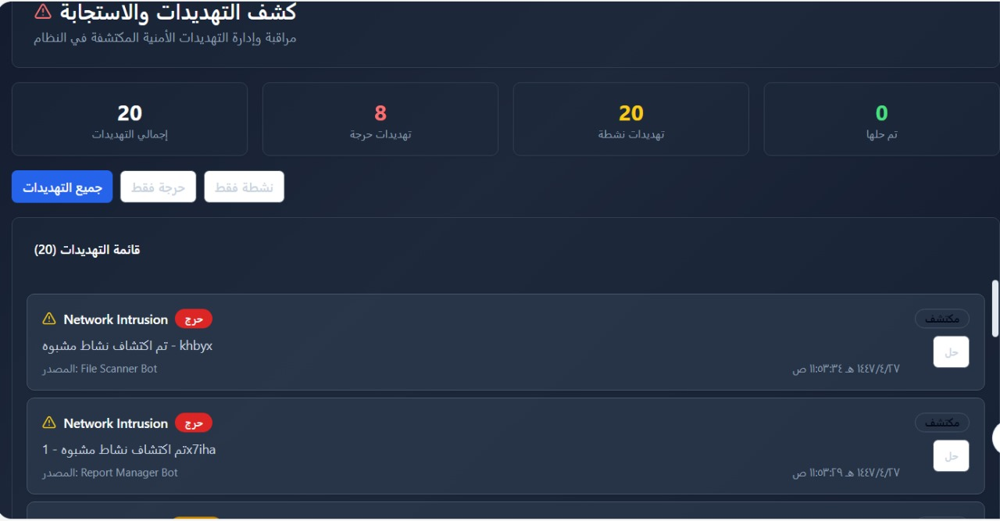
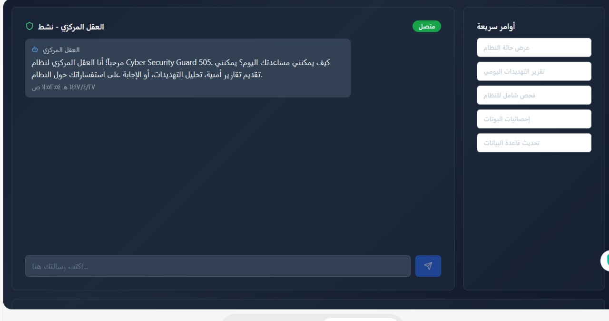
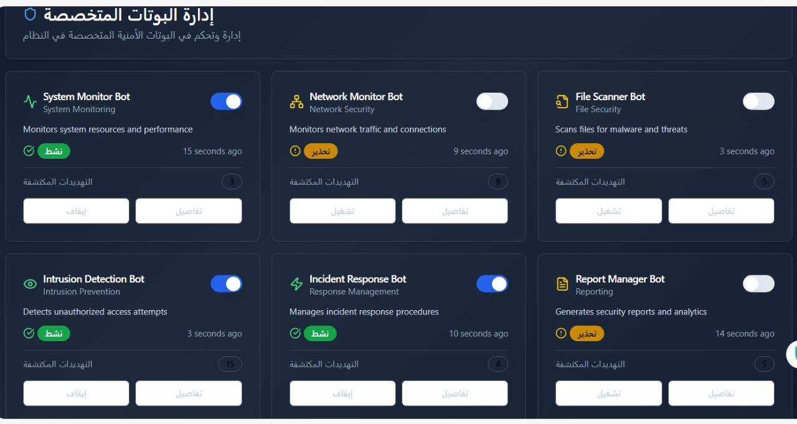
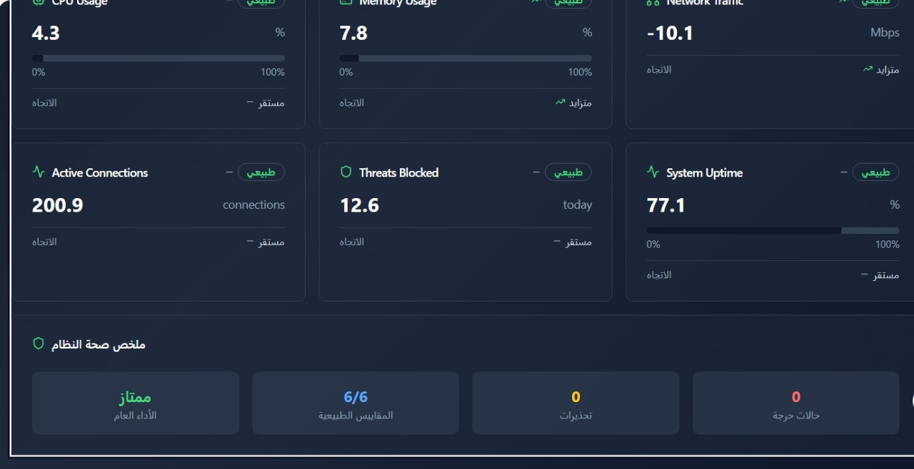
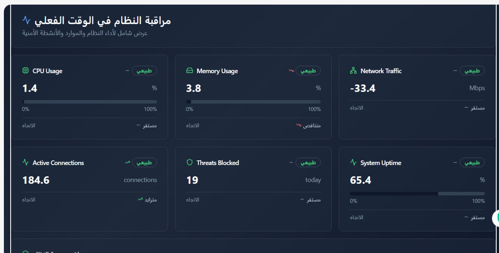

# 🖼️ دليل بصري لبرنامج Cyber Security Guard 505  
نسخة محسّنة 5.0.5 | Enhanced Version 5.0.5

هذا الملف يحتوي على عرض مرئي منظم لجميع وظائف البرنامج، مع شرح ثنائي اللغة لكل صورة.  
This file provides a structured visual overview of all program functions, with bilingual descriptions for each image.

---

## 1️⃣ لوحة التحكم الرئيسية | Main Dashboard

📍 المسار: `images/CSG1.jpg`  
🖼️ الصورة:

🔹 الوصف بالعربية:  
تعرض هذه الصورة نظرة عامة على حالة النظام، عدد البوابات المحمية، التهديدات المكتشفة، وصحة النظام، بالإضافة إلى حالة المراقب المركزي وتحديثه اللحظي.

🔹 Description in English:  
This image shows an overview of system status, protected gateways, detected threats, system health, and the central monitor with live update status.

---

## 2️⃣ كشف التهديدات والاستجابة | Threat Detection & Response

📍 المسار: `images/CSG2.jpg`  
🖼️ الصورة:

🔹 الوصف بالعربية:  
تُظهر الصورة لوحة كشف التهديدات، مع إحصائيات دقيقة حول عدد التهديدات الكلي، الحرجة، المكتشفة، والحالات التي لم تُحل بعد، بالإضافة إلى قائمة تفصيلية لكل تهديد.

🔹 Description in English:  
This screenshot displays the threat detection panel, with detailed statistics on total, critical, and unresolved threats, along with a list of individual threat entries.

---

## 3️⃣ العقل المركزي - نشط | Central Intelligence - Active

📍 المسار: `images/CSG3.jpg`  
🖼️ الصورة:

🔹 الوصف بالعربية:  
واجهة تفاعلية للعقل المركزي للنظام، تتيح بدء حوار SOS وتحليل التهديدات، مع خيارات وصول سريعة لحالة النظام، السجلات، والإعدادات.

🔹 Description in English:  
An interactive interface for the system’s central intelligence, enabling SOS dialogue and threat analysis, with quick access to system status, logs, and settings.

---

## 4️⃣ إدارة البوتات المتخصصة | Specialized Bots Management

📍 المسار: `images/CSG4.jpg`  
🖼️ الصورة:

🔹 الوصف بالعربية:  
تعرض الصورة إدارة البوتات المتخصصة مثل مراقب النظام، مراقب الشبكة، ماسح الملفات، مكتشف التسلل، مستجيب الحوادث، ومدير التقارير، مع حالة كل بوت وعدد التهديدات التي تم التعامل معها.

🔹 Description in English:  
This image shows the management of specialized bots including system monitor, network monitor, file scanner, intrusion detector, incident responder, and report manager, with status and threat count for each.

---

## 5️⃣ لوحة أداء النظام | System Performance Dashboard

📍 المسار: `images/CSG5.jpg`  
🖼️ الصورة:

🔹 الوصف بالعربية:  
مؤشرات الأداء تشمل استخدام المعالج، الذاكرة، حركة الشبكة، عدد الاتصالات النشطة، عدد التهديدات المحجوبة، ومدة التشغيل، مع ملخص شامل لحالة النظام.

🔹 Description in English:  
Performance indicators include CPU usage, memory usage, network traffic, active connections, blocked threats, and system uptime, with a comprehensive system health summary.

---

## 6️⃣ مراقبة النظام في الوقت الفعلي | Real-Time System Monitoring

📍 المسار: `images/CSG6.jpg`  
🖼️ الصورة:

🔹 الوصف بالعربية:  
مراقبة لحظية لاستخدام الموارد مثل المعالج، الذاكرة، الشبكة، الاتصالات، والتهديدات المحجوبة، مع حالة "طبيعي" لكل مؤشر لضمان استقرار النظام.

🔹 Description in English:  
Live monitoring of resources including CPU, memory, network, connections, and blocked threats, with "Normal" status indicators ensuring system stability.

---

📌 ملاحظات تنفيذية:
- تأكد من أن الصور موجودة فعليًا داخل مجلد `images/` في الريبو.
- يمكن ربط هذا الملف داخل `README.md` أو عرضه كمستند مستقل.
- التنسيق متوافق تمامًا مع GitHub ويظهر بشكل أنيق في العرض المباشر.

